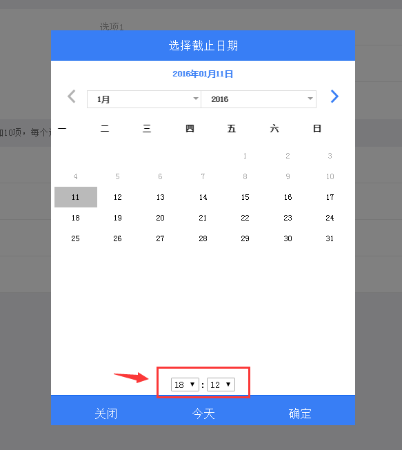

## Base  

[base ionic-datepicker](https://github.com/rajeshwarpatlolla/ionic-datepicker)

[Thanks Rajeshwar](https://github.com/rajeshwarpatlolla)

## Add 

```javascript

$scope.datepickerObject = {
                  titleLabel: '选择截止日期',
                  todayLabel: '今天',  
                  closeLabel: '关闭', 
                  setLabel: '确定',  
                  setButtonType : 'button-assertive',  
                  todayButtonType : 'button-assertive', 
                  closeButtonType : 'button-assertive',  
                  inputDate: Today, 
                  mondayFirst: true, 
                  weekDaysList: ["日", "一", "二", "三", "四", "五", "六"], 
                  monthList: ["1月", "2月", "3月", "4月", "5月", "6月", "7月", "8月", "9月", "10月", "11月", "12月"], 
                  templateType: 'modal', //modal/popup
                  showTodayButton: 'true', 
                  modalHeaderColor: 'bar-positive', 
                  modalFooterColor: 'bar-positive',
				  hastime:true, //add timepicker only use templateType modal
				  currentHour:10, //default hour
				  currentSec:30,   //default Minutes
                  from: Today, 
                  to: new Date(Today.getFullYear()+10,11,31), 
                  callback: function (val) { 
                   datepickerObjectCallback(val);
                  },
                  dateFormat: 'yyyy年MM月dd日', 
                  closeOnSelect: false, 
            };        

            var datepickerObjectCallback = function (val) {
                  if (typeof(val) === 'undefined') {

                    console.log('No date selected');

                  } else {
					  
					$scope.datepickerObject.inputDate = val;
					//$scope.datepickerObject.currentHour = 10;
					//$scope.datepickerObject.currentSec = 30;
					
                    $scope.public.endDateshow = $filter('date')(val,'yyyy-MM-dd HH:mm');
                  }
                };

```



